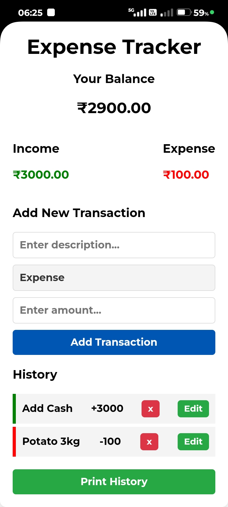

# Expense Tracker

This is a simple web-based **Expense Tracker** application that allows users to track their income and expenses in **Indian Rupees (₹)**. Users can add, view, and delete transactions, and the app automatically calculates the balance, income, and expenses.

## Features
- Track income and expenses.
- Automatically updates the balance based on transactions.
- View income and expenses separately.
- Add and remove transactions.

## Technologies Used
- **HTML**: Structure of the web page.
- **CSS**: Styling of the page to make it visually appealing.
- **JavaScript**: Functionality for adding, removing transactions, and calculating balance.

## Installation

1. Clone the repository:
    ```bash
    git clone https://github.com/iamsamimsarkar/expense-tracker.git
    ```

2. Open the `index.html` file in your browser to start using the application.

## Usage
1. Add a transaction by filling in the description and amount fields.
2. The balance will automatically update in **₹**.
3. You can view your income and expenses separately.
4. To remove a transaction, click the **'x'** button next to the transaction.

## Screenshots
Add screenshots here (e.g., how the app looks in the browser).

## License
This project is licensed under the MIT License - see the [LICENSE](LICENSE) file for details.

## Author
- **Samim Sarkar** - [GitHub Profile](https://github.com/iamsamimsarkar)
## Screenshots
### Home Page  

